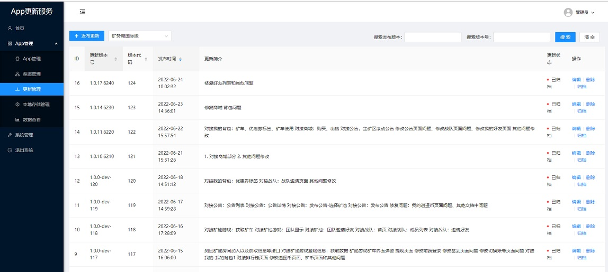

# app-update-server

一个用于app更新的服务端

---

## 简介

app-update-server 是一个简易的 更新服务端 ，可以用于 Android 或其他类型的 APP 联网检查更新，下载更新。

服务对外提供了HTTP接口，您只需要在APP中调用接口，即可知道是否有更新，如果有更新，您还可以调用更新所上传或者设置的安装包下载路径，下载安装包进行安装。（抱歉暂时无app端封装的模块，您需要自己写app的请求，下载更新，安装更新逻辑）。

本服务端使用 SQLite 数据库，免去安装数据库的烦恼，可直接运行。

本服务端提供一个易用的 Web 管理界面，您可以通过管理界面上传更新，修改更新，启用更新等等，作者公司内部使用了下感觉还算不错。

希望这个项目可能对您有用！



## 安装

本项目需要：

* nodejs 14.0.0+
* redis

安装步骤：

1. 您可以在 Release 中找到已编译的安装包，如果需要自己编译，也可参考下方 [通过源码编译](#通过源码编译) 章节。
2. 解压安装包至服务器某个位置。
3. 配置 `config/config.json` ，设置您的特殊配置。
4. 使用命令启动服务器，您可以使用 `node app.js` 直接运行，也可以使用 [pm2](https://www.npmjs.com/package/pm2) 运行 `pm2 start app.js`。
5. 使用您喜欢的服务器做反向代理，将本服务暴露至外网，然后就可以访问了。

## config.json 配置说明

```js
{
  //配置 Redis 的地址
  "REDIS_ADDRESS": "127.0.0.1", 
  //配置 Redis 的端口
  "REDIS_PORT": 6379,
  //配置 Redis 的密码，为空则表示没有密码
  "REDIS_PASS": "",
  //配置 Redis 的数据库，默认是 0 号数据库
  "REDIS_DB": 0,
  //主要数据库文件名
  "DB_FILAE_NAME": "updateServer.db",
  //这个参数用于生成登录token时的加密（aes-128-cbc），如有需要，可以生成
  "AUTH_KEY": "W+JAwCTvlZhapJC5",
  "AUTH_IV": "e4e1825d5c306ec9",
  //阿里云上传配置可不填，如果未配置，则上传阿里云按钮将禁用
  //阿里云OSS上传RAM账号的ACCESS_KEY
  "ALIYUN_OSS_ACCESS_KEY": "dsadfgasdgfd",
  //阿里云OSS上传RAM账号的ACCESS_SECRET
  "ALIYUN_OSS_ACCESS_SECRET": "dafgadfgdgafdg",
  //阿里云OSS上传角色ARN，参见 https://help.aliyun.com/document_detail/32077.html
  "ALIYUN_OSS_ACCESS_ACS": "sdaagsdgadfgadg",
  //阿里云OSS上传 bucket 名称
  "ALIYUN_OSS_BUCKET": "imengyu",
  //阿里云OSS上传区域，参见阿里云控制台
  "ALIYUN_OSS_REGION": "oss-cn-shanghai",
  //Web管理后台登录过期时间，单位是毫秒
  "AUTH_DEF_EXPIRE_TIME": 80000000,
  //Web管理后台登录过期时间（勾选记住的情况），单位是毫秒
  "AUTH_MAX_EXPIRE_TIME": 2592000000,
  "VERSION": "1.0.32",
  //公网URL，这个URL用于上传文件时生成外链所用，如果配置不正确，可能导致文件无法下载
  "PUBLIC_URL": "http://localhost:3012",
  //指定服务运行的端口
  "PORT": 3012
}
```

## 检查更新更新接口 `/update-check`

### 请求方法

GET

### 请求参数

|参数名|类型|必填|说明|示例|
|--|--|--|--|--|
|package_name|string|是|一个唯一标识，表示这是哪个APP，在后台App管理中可以配置|com.ttswl.miningapp|
|version_code|number|是|表示APP当前版本|123|
|version_name|string|是|APP当前版本的文字形式|1.1.2|
|channel|string|否|APP当的渠道，如果不填，默认是主渠道|main|
|其他参数|any|否|可填写其他更多参数，用于后台**推送条件**规则判断|-|

### 返回数据

```json
{
  "success": true,
  "code": 20000,
  "message": "成功",
  "data": {
    "hasUpdate": true,
    "newVersionCode": 167,
    "newVersionName": "1.0.802.0",
    "newVersionNote": "修复问题",
    "downloadUrl": "https://tts-update.oss-cn-hangzhou.aliyuncs.com/miningapp-1.0.802.0-dev-release-202208021535.apk"
  }
}
```

|参数名|类型|必填|说明|
|--|--|--|--|
|success|string|是|表示当前请求是否成功|
|code|number|是|一个请求状态码|
|message|string|是|错误信息说明文字|
|data|object|是|检查更新结果|

data 属性说明：

|参数名|类型|必填|说明|
|--|--|--|--|
|hasUpdate|boolean|是|表示当前APP是否有更新|
|newVersionCode|number|否|最新版本的版本号, 仅在hasUpdate为true时有此字段|
|newVersionName|string|否|最新版本的版本名称, 仅在hasUpdate为true时有此字段|
|newVersionNote|string|否|最新版本的更新说明, 仅在hasUpdate为true时有此字段|
|downloadUrl|string|否|最新版本的更新下载URL, 仅在hasUpdate为true时有此字段|

## 使用说明

通过 `你的服务地址/admin/` 可以进入管理后台。

系统默认登录密钥：`admin@123456`，登录后请在 系统管理 > 用户控制 > 编辑 admin 中，点击 “重置密码” 按钮 重置密码。

1. 添加应用. 你需要在 App 管理中，添加一个应用，并设置它的包名（App调用接口中的参数是package_name），并设置名称。
2. 然后可以在更新管理中添加更新。您可以设置版本号，上传安装包，并设置相关渠道，或者是一些自定义判断条件。
3. 这之后，您就可在您的 App 中调用服务的检查更新接口了，如果接口传入版本号小于最新更新的版本号，则会返回有新的更新，您可以弹窗提示用户，或者可以调用更新所上传或者设置的安装包下载路径，下载更新并安装。
4. 如果更新时间太久不再使用，您也可以将其删除，或者点击归档，归档会删除安装包以释放空间，仅保留更新信息以作备份。

## 通过源码编译

1. 首先克隆源码。
2. 运行 `npm i` 安装依赖
3. 运行 `npm run build-prod` 构建服务端
4. 进入 web 目录
5. 运行 `npm i` 安装依赖
6. 运行 `npm run build` 构建管理端
7. 构建完成，在 `项目目录/dist/production` 中就是已编译的程序，可直接运行。
